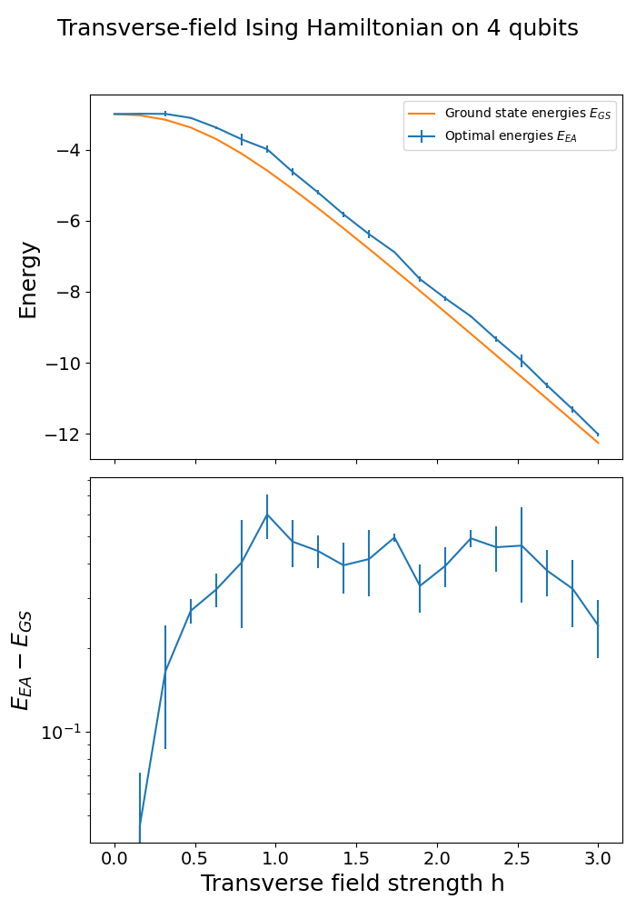

# Genetic Algorithm for Quantum Circuits

This repository contains the code base for our project 'Genetic Algorithms for Quantum Circuits'.
Currently, it implements a Genetic Algorithm that initializes a generation of quantum circuits, and evolves
this set of circuits through the methods of selection, crossover and mutation through subsequent generations.
The goal of the algorithm is to minimize the energy (expectation value of the hamiltonian in the state resulting from the quantum circuit). In contrast to common
VQE approaches, we do not optimise the parameters of a given ansatz, but aim to achieve the minimisation 
through the evolutionary algorithm itself, drawing from a pre-defined and finite gate set for the ansatz (a weight-agostic approach,
in which results are averaged over a few sets of parameters without explicitly updating the parameters, could be investigated in future work).
By design, this optimisation routine is gradient-free. However, in order to allow for better optimisation results, one can also opt to optimize
the best-performing circuit for a given transversal field strength with a VQE procedure (it would also be possible to perform a full VQE optimisation for each circuit, 
or at the end of a generation, but since our focus is on the impact of evolutionary search, this would most likely further obscure the relationship
we are interested in investigating, so we settle for this optional capability as a trade-off). In general, the algorithm depends on the choice of a number of hyperparameters, 
most notably the number of circuits in each generation, number of generations, circuit depth and initial mutation rate (the mutation rate is adapted generation-dependent).

# Instructions on how to run the code
After cloning the repository and installing the necessary requirements with
```bash
pip install -r requirements.txt
```
the central Genetic Algorithm can be executed my running the command 
```bash
python3 main.py 
```
in the terminal.

This will initialise the GA, which produces intermediate output similar to 

{ width=750px}

and saves the outputs in the folder plots_optimality. A sample output of the optimisation results for $h=1.33$ on five qubits in the VQE-optimized setting is provided below.

{ width=300px}

# Architectural elements of the algorithm

- [main.py:](https://gitlab.tudelft.nl/ap3751-projects-2025/ap3751-2025-project17/-/blob/main/main.py?ref_type=heads)

This file controls the various modules from gen_alg_VQE.py, running the algorithm and generating the plots of energies with respect to the Transverse Ising strength h.
In particular, this file handles the following workflow: For each transverse field strength h, a genetic algorithm is initialized and the optimisation routine performed, returning the best approximation of the ground state energy as well as the circuit corresponding to this optimal performance, after which the z-magnetization of the best-performing circuit is extracted. These results are averaged over multiple runs in order to produce error estimates on the effectiveness of the method.

- [gen_alg_VQE.py:](https://gitlab.tudelft.nl/ap3751-projects-2025/ap3751-2025-project17/-/blob/main/gen_alg_VQE.py.py?ref_type=heads)

This file contains the core elements of the evolutionary algorithm. Firstly, it defines the class VQE_ansatz, which most prominently contains the attributes self.circuit_matrix (for the matrix representation of the circuit), self.hamiltonian (to indicate the measurement operator) and self.energy (to store the expectation of the measurement operator), and a variety of methods that control random circuit (tensor) generation, tensor to circuit transformation, the definition of the given observable Hamiltonian, the computation of fitness via circuit measurement, the logic of mutations and crossover, the computation of the ground state energy and the visualisation of the circuit.

Secondly, it defines the class Evolutionary_Algorithm, which contains the attributes self.num_circuits, self.num_of_generations, self.num_qubits, self.depth, self.mutation_rate as hyperparameters as well as some other attributes such as self.best_circuit and self.best_energy to aid the extraction of relevant information about the optimisation.
In terms of methods, this class defines the selection protocol (tournament) and builds the function for the evolutionary process (function perform_evolution) using the VQE_ansatz class. In particular, after initialising the set of circuits (with num_circuits in total), this function selects the parents allowed to reproduce following the tournament, after which the selected circuits perform crossover, followed by a round of possible mutations on the offspring and a fitness evaluation of the new circuits.

- [hyperparameter_opt.py:](https://gitlab.tudelft.nl/ap3751-projects-2025/ap3751-2025-project17/-/blob/main/hyperparameter_opt.py?ref_type=heads)

This script performs hyperparameter tuning over the following parameters:

 | Hyperparameter | description |
 |-------------|---------------|
 | depth |number of sequential layers of gates of the VQE ansatz |
 | num_circuits |number of VQE ansatzs in each generation | 
 | num_generations | number of evolution steps of the Genetic Algorithm| 
 
Fixing two of them, we vary the other one to find which value of that parameter yields the minimum estimated GS energy. Execution of the single hyperparameter optimisation can be controlled via setting the corresponding flags to True.

Additionally, we perform two-fold hyperparameter optimisation by fixing one of the aforementioned hyperparameters and varying the remaining two over an equidimensional lattice. This has the advantage of revealing dependencies between different hyperparameters (think: for a higher depth, we need an increased number of generations to achieve similar results). Since we are working with pairs of parameters out of a set of three hyperparameters, we thus create the $\binom{3}{2} = 3$ corresponding heatmaps, which may be used to, firstly, tune the parameters set for the optimal run controlled by main.py, and secondly, to investigate the underlying dependencies of parameters in our algorithm. Note that there are many other hyperparameters we could include in this investigation, such as the mutation rate or number of qubits (these were omitted due to computational constraints).

*Example Heatmap for two-parameter optimisation:*

{ width=300px }

In this heatmap, we see that the depth and number of generations are correlated, since when increasing the depth, the number of generations required to find an ansatz yielding an energy close to the ground state increases. Moreover, we observe that a value of depth = 7 seems to be (almost) optimal for different number of generations values, although the optimal energy is found for depth = 6 and 100 generations.

# Results

The goal of our algorithm is to approximate the ground state energy of the transverse-field Ising Hamiltonian $H = -J\sum_{(i,j)\in E} \mathbb{1}-Z_iZ_j + h \sum_i X_i$, with $J = 1$, over a range of transverse-field strengths $h$.
We find that the EA is capable to find observable eigenvalues close to the desired ground state energy of the Hamiltonian across a wide range of transversal field strenghts. The below plot shows both the analytical ground state energy and the optimal energy as found by the EA in an experiment on four qubits.

{ width=300px}

We obtain similar results when optimizing the best-performing circuit with a VQE approach.

{ width=300px}

Note that the combination of Evolutionary Algorithm and VQE changes the role of the EA in the workflow: Instead of carrying the entire optimisation, it guides the search of a good ansatz for optimisation of angles.

Furthermore, by extracting the $z$-magnetization of the best-performing circuits, we are able to extract the quantum phase transition of the given Hamiltonian. For the given transverse-field Ising Hamiltonian, a phase transition from ordered ferromagnetic to unordered phase occurs at $|\frac{h}{J}| =1 \mapsto |h| = 1$. This transition can be observed across all system sizes in consideration, with the case of six qubits being depicted below.

{ width=300px}

Note: we only used values of the transverse field strength up to h = 2 in order to display better resolution near the phase transition.

## Individual Contributions of authors

The following inidividual contributions are reflected in the commits to the GitLab repository that this file accompanies.

   Contributor | Contributions |
 |-------------|---------------|
 | Cesar | Implemented GA for Knapsack problem code from Medium article (used later on as a model for VQE_ansatz and Evolutionary_Algorithm classes); Integrated tensor to circuit mapping and random circuit generation code (done by Arturo and Tim, respectively) as methods of VQE_ansatz class, definining its attributes; Implemented build_hamiltonian, fitness, visualize_circuit and calculate_ground_state_energy methods of VQE_ansatz class and corrected logic of selection method of Evolutionary_Algorithm class; Worked on one-fold hyperparameter tuning with Arturo and on two-fold hyperparameter tuning with Tim and Arturo |
 | Arturo | Main contributions: Implemented mutation method; Implemented random circuit generation for initialising the set of circuits; Created function for the two hyperparameter optimisation, and developped with César the single parameter optimisation; Implemented error bars in the energy and z-magnetisation plots by doing multiple runs. <br> Extra contributions: added probabilistic use of entanglement-aware crossover with sigmoid function in the crossover mechanism; corrected and cleaned code when needed; helped generating two-hyperparameter optimisation plots|
 | Badr | Started with focus on the ranking system and selection/crossover procedure, and what configuration we should use. Then mostly focused on automized hyperparameter searching, however since this did not perform well it was taken out.  |
 | Lukas | Main contribution: Implemented selection procedure; Implemented basic and advanced crossover strategy; Did a lot of debugging; Wrote code for hyperparameter optimization; |
 | Tim | Implemented tensor to circuit mapping; Created EA workflow with simple mutation rules; Created and optimised comparison plots for energy optimisation over generations; Implemented code to extract z-magnetisation and analyse phase transition; Adapted Arturo's and Cesar's pairwise hyperparameter plotting in heatmap; analyzed optimal hyperparameters and adapted code accordingly; implemented VQE optimisation for best circuit; ran VQE and non-VQE setting on multiple system sizes to obtain final results; Conducted general code cleaning and documentation; Added project walkthrough to README; created requirements.txt, added instructions on how to run code to repository and tested|


